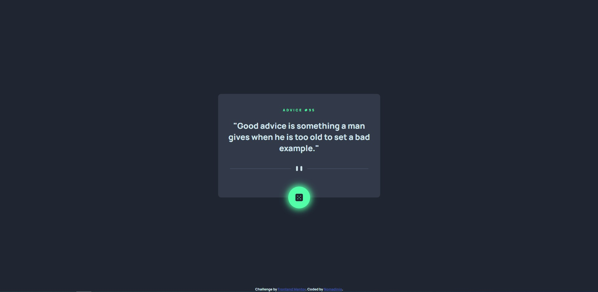

# Frontend Mentor - Advice generator app solution

This is a solution to the [Advice generator app challenge on Frontend Mentor](https://www.frontendmentor.io/challenges/advice-generator-app-QdUG-13db). Frontend Mentor challenges help you improve your coding skills by building realistic projects.

## Table of contents

- [Overview](#overview)
  - [The challenge](#the-challenge)
  - [Screenshot](#screenshot)
  - [Links](#links)
- [My process](#my-process)
  - [Built with](#built-with)
  - [What I learned](#what-i-learned)
- [Author](#author)

## Overview

### The challenge

Users should be able to:

- View the optimal layout for the app depending on their device's screen size
- See hover states for all interactive elements on the page
- Generate a new piece of advice by clicking the dice icon

### Screenshot

### Links

- [Solution URL](https://www.frontendmentor.io/solutions/advice-generator-app-ktfuHSdxFi)
- [Live site URl](https://advice-generator-nomadinio.netlify.app/)

## My process

### Built with

- HTML
- CSS custom properties
- Flexbox
- Mobile-first workflow
- Javascript

### What I learned

My first project with API, it was fun to do.

## Author

- Frontend Mentor - [@Nomadinio0](https://www.frontendmentor.io/profile/Nomadinio0)
- GitHub - [Nomadinio0](https://github.com/Nomadinio0)
